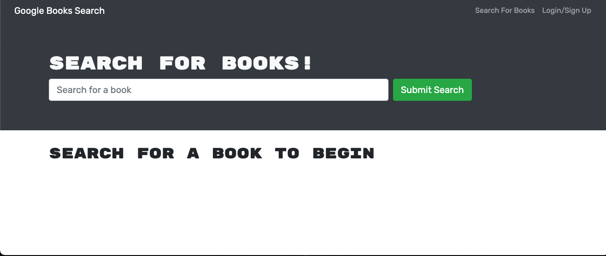

  

 

# My Book Search

This is a React-based Google Books Search app. 

You can clone this repo.

git clone git@github.com:chergul/MyBookSearch.git

## Table of Contents
* [How to Use](#how-to-use)
* [Heroku Deployment](#heroku-deployment)
* [Video for the app](#video-for-the-app)
* [Questions](#questions)

## How to Use

As a reader, I want to search books from google. This helps user to fund books. 

## Heroku Deployment

https://fathomless-ocean-99597.herokuapp.com

## Video for the app
​

## Questions
If you have any questions about this repo, you can open an issue, or contact directly at 
ceyda_hergul@hotmail.com
Pull requests are welcome